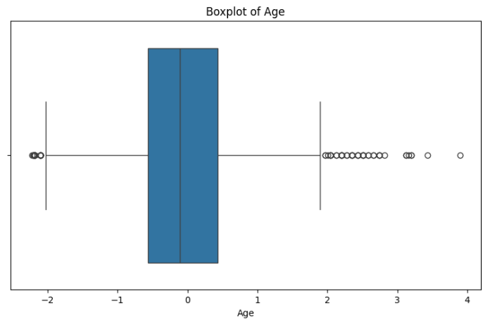
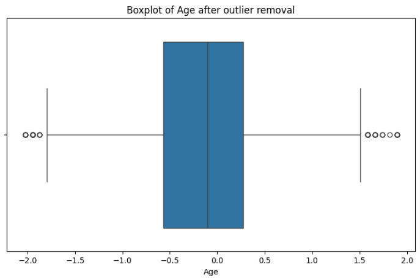
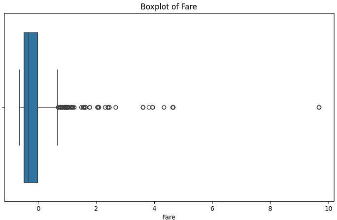
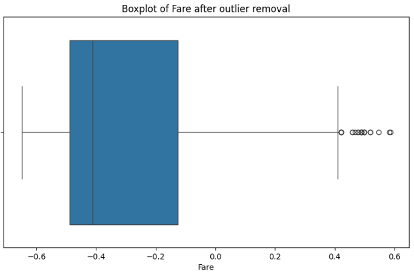

# Task 1: Data Cleaning & Preprocessing

This repository contains my solution for Task 1 of the AI/ML Internship. The focus of this task is to clean and preprocess the Titanic dataset to make it ready for training machine learning models.

---

## Objective

Learn how to clean and prepare raw data for ML.

---

## Files Included

| File Name                     | Description                                        |
|------------------------------|----------------------------------------------------|
| `Titanic-Dataset.csv`        | Raw dataset used for this task                     |
| `titanic_preprocessing.ipynb`| Jupyter Notebook with all preprocessing steps      |
| `screenshots/`               | Folder containing output visuals                   |
| `README.md`                  | Project documentation                              |

---

## What I did

I began by exploring the dataset using basic pandas commands like df.head(), df.info(), and df.describe(), which helped me understand the structure and detect missing values.

For missing values:

Age had a significant number of missing values and outliers. I chose to fill them using the median, which is more robust than the mean in skewed data.

Embarked had only two missing values. Being a categorical column, I filled these with the mode, i.e., the most common value.

Cabin had over 75% missing values, so I dropped the column to avoid unnecessary noise.

For categorical encoding:

I used Label Encoding on Sex and Embarked because both columns had only a few unique, non-ordinal values. This converted them into numeric form suitable for modeling.

I then applied StandardScaler to numerical features like Age, Fare, SibSp, and Parch. This was important because these features had different scales, and standardization helps many ML models perform better.

Finally, I used boxplots to visualize outliers in Age and Fare, then applied the IQR method to remove extreme values. This step helped improve the overall data quality by reducing the impact of outliers.

## Outlier Analysis (Before vs After)

### Boxplot of Age (Before Removing Outliers)


The Age column had several outliers on the higher end (standardized values > 2), indicating unusually old passengers. These values extended the upper whisker and created imbalance in the distribution.

### Boxplot of Age (After Removing Outliers)


After removing outliers using the IQR method, the age distribution became tighter and more symmetric, with most values lying between approximately -1.5 and 1.5. This improved the scale for modeling.

### Boxplot of Fare (Before Removing Outliers)


The Fare feature showed extreme outliers beyond 4 (standardized), with some reaching nearly 10. These few high-ticket prices were distorting the overall scale and variance.

### Boxplot of Fare (After Removing Outliers)


Outliers were successfully removed, with most values now within -0.6 to 0.6. The resulting distribution is much more balanced and better suited for standard scaling and model training.

---

## Tools & Libraries Used

- Python 3.12
- pandas, numpy — for data manipulation and analysis
- matplotlib, seaborn — for data visualization
- scikit-learn — for encoding and feature scaling

---

## What I Learned

Through this task, I learned the importance of proper data preprocessing before applying any machine learning models. I understood how missing values and outliers can distort a model's performance if not handled carefully. I also gained practical experience with pandas, sklearn, and visualization using seaborn.

---

## How to Run This Project

1. Clone the repository:
   ```bash
   git clone https://github.com/YOUR_USERNAME/task-1-data-cleaning-preprocessing.git
   cd task-1-data-cleaning-preprocessing
   ```

2. Install required libraries:
   ```bash
   pip install pandas numpy matplotlib seaborn scikit-learn
   ```

3. Open the notebook:
   ```
   jupyter notebook titanic_preprocessing.ipynb
   ```

---

## Author

**Anmol Thakur**  
GitHub: [anmolthakur74](https://github.com/anmolthakur74)
